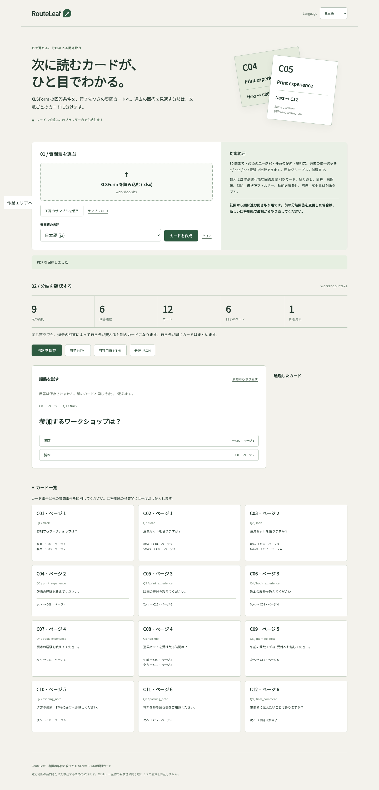

# RouteLeaf

**Verified build:** all three [hosted jobs](https://github.com/Masanori-Spec/route-leaf/actions/runs/37228150853) passed for `dd7d19a0497249b4b33bba806c09ca3cf5f3f37f`: 66 product tests on Node 22/24, 11 browser case groups, actual PDF exports, and six complete official ODK Web Forms UI traces. [Verification and limits](docs/VERIFICATION.md) · [Screenshots and evidence](docs/evidence/hosted/README.md)



Compile a small XLSForm into **paper interviewer cards with explicit next destinations**. When a question's continuation depends on earlier answers, RouteLeaf creates context-specific versions of that card. The interviewer follows one destination beside the current answer instead of reinterpreting a compound condition.

The browser application is a standalone, offline-capable HTML file. It has Japanese and English interface text, a separate questionnaire-language selector, a forward walkthrough, and PDF / printable HTML / answer-sheet HTML / JSON downloads. It sends no questionnaire data to a server.

## Try it

```sh
npm ci --ignore-scripts
npm run build
npm run serve
```

Open http://127.0.0.1:4178 and choose **Try the workshop example**, then **Create cards**. The built `dist/index.html` also works directly as a local file. The sample XLSX and fonts are included in that file; no CDN is required.

## The example demonstrates the difference

Nine source questions become **12 cards**, with **six reachable routing-answer histories**, **six booklet pages** and **one answer-sheet page**. `loan`, `print_experience` and `book_experience` each get two cards. The two printing-experience cards ask the same question, but one continues to kit pickup and the other to the final comment. Asking for no loan skips pickup completely: it does not create a fictional unanswered morning/evening combination.

Every card has a unique ID, source question number/name, and explicit next-card and booklet-page destinations. Cards are ordered by source question, so all jumps move forward. There are two cards per A4 booklet page. The answer sheet has one row per source question, including unasked questions left blank and information-only notes.

## Accepted input profile

- One `.xlsx`, maximum 8 MiB compressed / 24 MiB expanded
- `survey`, `choices`, optional `settings`; no other nonempty sheets
- Up to 30 questions; plain labels/hints in one selected language
- Required `select_one` with 2–8 static, distinct choice codes per list; choice text must fit the measured print layout
- Optional `text` and information-only `note` questions never control routing; required text is rejected
- Ordinary groups up to two nested levels; group relevance and labels are preserved; group hints are rejected
- Relevance: earlier `select_one` values compared to nonempty literal choice codes using `=`, `and`, `or` and parentheses
- Case-sensitive identifiers and choice codes: ASCII letters/underscore followed by letters/digits/underscore, up to 48 characters
- At most 512 reachable assignments to syntactically referenced routing controls and 80 merged cards; choices never referenced in relevance are not multiplied
- Embedded font covers Japanese and Latin text; unsupported glyphs, excessive text and print overflow reject the whole export

The compiler deliberately rejects repeats, calculations, nonempty defaults or constraints, dynamic requiredness, filters, external choices, numeric/text comparisons, `!=`, `not()`, empty-value comparisons, label substitutions, HTML/Markdown links, media, formula cells, and OOXML-encoded `_xHHHH_` string escapes. Escape-bearing strings are rejected rather than interpreted incompletely. Unknown nonempty columns are errors; no partial conversion is offered. This is a bounded compiler, not a general XLSForm-to-PDF converter.

Answer-sheet pages contain at most ten source questions. A 30-question form can therefore have three answer-sheet pages. The UI distinguishes booklet page count from answer sheets.

### Forward interviews only

Start at the printed start card, use a clean answer sheet, and follow only the destination given. If an earlier routing answer changes, **restart from the beginning with a clean answer sheet**. Do not jump to a different variant based on a corrected answer. The walkthrough intentionally provides Restart rather than back-editing.

## Verification

```sh
npm run check                         # build, unit tests, example exports
npm ci --prefix oracle --ignore-scripts
python -m pip install -r oracle/requirements.txt -r requirements.txt
python oracle/compile.py
npm run test:consumer-unit
npm run test:oracle                   # official ODK engine vs independent JSON graph traversal
CHROME_BIN=/usr/bin/google-chrome npm run test:browser
CHROME_BIN=/usr/bin/google-chrome npm run test:consumer-browser
python scripts/check-pdf.py test-results/browser/workshop-en.pdf test-results/browser/workshop-en.routes.json --render test-results/pdf-en
```

The external consumer dependencies are pinned separately: pyxform 4.5.0, official `@getodk/xforms-engine` 1.0.3 and official `@getodk/web-forms` 1.0.3. The consumer job uses Node 24.16.0 and sandboxed system Chrome on Ubuntu 22.04. It operates on the original XLSX and exported JSON, never imports RouteLeaf's parser/renderer, and never trusts the compiler's precomputed history list. The actual ODK Vue component is driven through its real controls and local submission callback.

`docs/VERIFICATION.md` distinguishes local passes from hosted gates. Actual PDF downloads are independently inspected with PyMuPDF and rendered with Poppler. Automated geometry checks do not replace the final all-page visual review.

## Scope of the evidence

This project demonstrates exhaustive forward-routing equivalence for the accepted example's finite routing histories and the tested engine version. It does not establish complete XLSForm compatibility, equivalence to ODK Collect or every client, measured reductions in human errors, or demand for this exact product. Text responses are represented by test strings because text never affects routing. Changing old answers and repeated/backward interviews are outside the accepted workflow.

See [prior products and positioning](docs/PRIOR_ART.md), [compiler method](docs/ALGORITHM.md), [print layout](docs/PRINT.md), [security boundaries](docs/SECURITY.md), and [third-party notices](docs/THIRD_PARTY.md).
